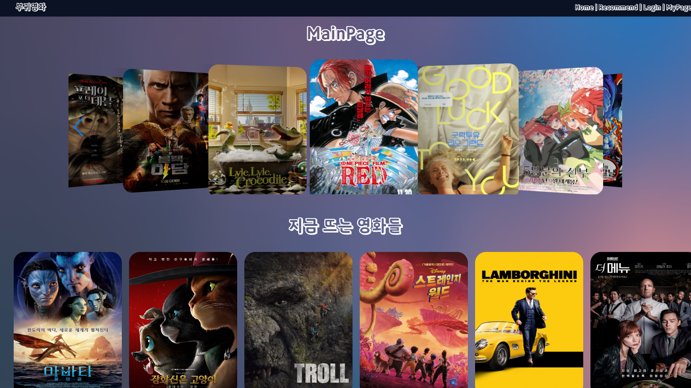
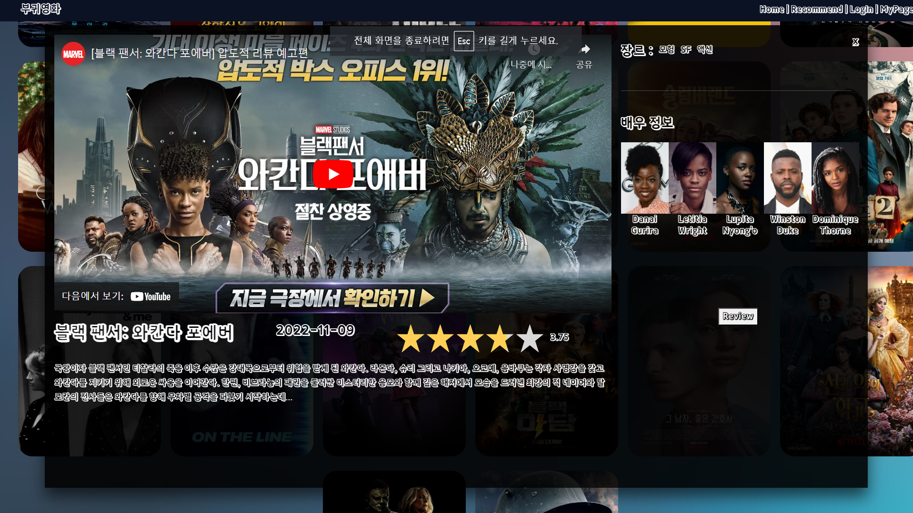
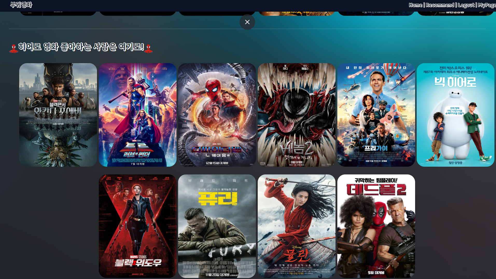
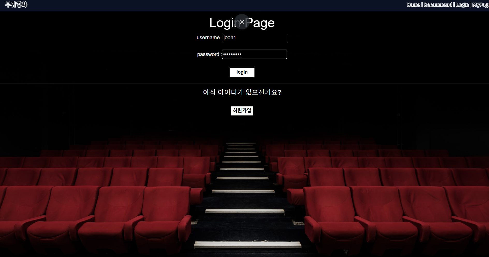

# **부귀영화**  
### SSAFY 1학기 최종 2인 프로젝트  
**프로젝트 기간**: 2022.11.15 ~ 2022.11.25 
**팀원**: 임성준, 전태영  
**진행 상황**: 2024.12 기준 현재 전체 수정 작업 중  

---

## **프로젝트 개요**  
부귀영화는 영화 추천 웹 애플리케이션으로, Django를 기반으로 한 백엔드와 Vue.js를 활용한 프론트엔드로 개발되었습니다.  

### **주요 특징**  
- **첫 웹 개발 프로젝트**  
- 영화 추천 알고리즘 구현 및 사용자 친화적 UI/UX 설계  
- 프론트엔드와 백엔드 개발을 모두 수행하며 팀장 역할 담당  

---

## **사용 기술 스택**  
- **백엔드**: Django, Django REST Framework (DRF), Python  
- **프론트엔드**: Vue.js, JavaScript  
- **데이터베이스**: SQLite 
- **버전 관리**: Git, GitHub  

---
## **주요 기능**  
1. **사용자 인증 및 로그인**  
   - Django DRF를 활용한 회원가입 및 로그인 API 구현  

2. **영화 추천 기능**  
   - Python 기반 추천 알고리즘 개발  
   - 사용자의 선호도를 기반으로 영화 추천  

3. **영화 상세 정보 제공**  
   - 선택한 영화의 예고편, 배우 정보, 장르 정보를 API로 받아와 표시  

4. **프론트엔드 기능**  
   - Vue.js로 구성된 직관적이고 반응형 UI  
   - 다양한 페이지 간 동적 전환  

---

## 주요기능 및 화면
- 메인 페이지

- 영화 개별 클릭시 뜨는 화면

- 영화 추천 페이지 

- 로그인 페이지

